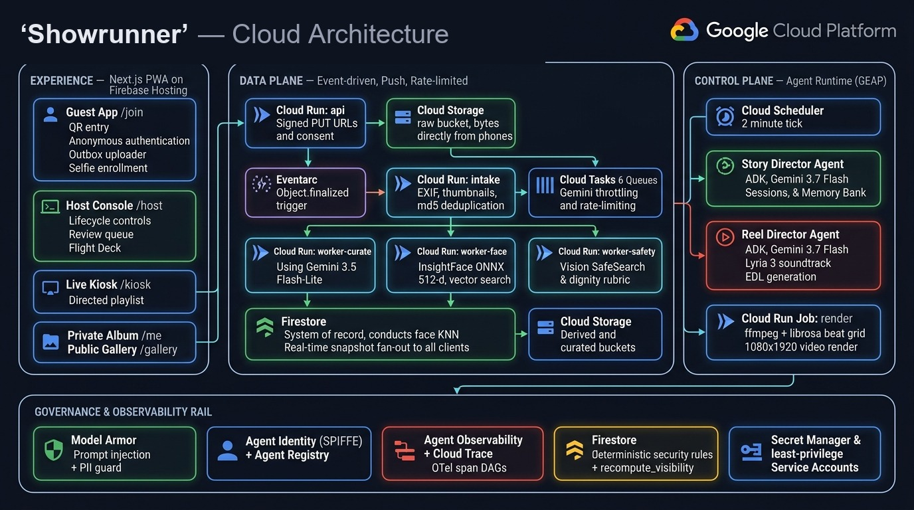

<p align="center"></p>

# Showrunner — the autonomous media director for live events

**The Twist: when event coverage is missing, the agent doesn't wait for humans — it tasks them.**
Guests scan a QR and upload photos. A fleet of agents classifies every shot, indexes faces, screens
for dignity and safety, runs the venue's big screen, detects coverage gaps against the timeline,
dispatches photo **bounties** to guests' phones, and directs beat-synced highlight reels with
AI-composed soundtracks — **while the event is happening. No chat window exists anywhere in this
product.**

[▶ demo video]({{VIDEO_URL}}) · [🚀 Live demo (judge mode)](https://showrunner-hq.web.app/judge) · [📐 Architecture](#architecture) · [📝 Build log / blog]({{BLOG_URL}})

> **Category: The Taskmaster** — a multi-step background workflow the agent intercepts and completes
> **without human intervention**. Built solo by Shantanu ([`Shantanu-00`](https://github.com/Shantanu-00)) for the All Things Agentic Hackathon.

## ✅ Hackathon compliance at a glance

| Requirement | Status | Where |
|---|---|---|
| Gemini 3.5 or newer via Gemini API / Vertex AI | ✅ `gemini-3.5-flash-lite` (perception volume) + `gemini-3.7-flash` (director reasoning) | `backend/services/gemini.py`, called from `backend/workers/{curate,safety}/agent.py` and `backend/directors/{story,reel}/agent.py` |
| ≥1 Google Agent Framework | ✅ **ADK v2 (Python)** + **GenAI SDK** | `backend/workers/{curate,safety}/agent.py`, `backend/directors/{story,reel}/agent.py` — each an ADK `LlmAgent` |
| ≥1 GCP infrastructure service | ✅ Cloud Run (7 services + a render job), Firestore (+ native vector search), Cloud Storage, Eventarc, Cloud Tasks, Cloud Scheduler | [service table](#google-cloud-services--used-and-called-in-code) |
| Hosted project URL | ✅ [`showrunner-hq.web.app/judge`](https://showrunner-hq.web.app/judge) — guided judge tour; host credentials in the Devpost testing instructions | live through the judging period |
| Architecture diagram | ✅ [below](#architecture) + `docs/architecture.md` | — |
| Spin-up instructions | ✅ [two-tier reproducible spin-up](#spin-up-two-tiers) — one tier needs no GCP account at all | `deploy/up.sh` |
| Demo video ≤ 4 min, public, GCP proof | ✅ {{VIDEO_URL}} — unedited live execution + Cloud Run / Cloud Scheduler / Firestore console proof | — |
| Bonus models | ✅ **Lyria 3** (every reel's soundtrack), **Veo 3.1 Fast** (couple-reel opener), **Gemma 4** (private taste memos) | [bonus table](#bonus-google-ai-models--each-with-a-real-job) |
| Bonus content + social | 🚧 blog draft in [`docs/post/devto_article.md`](docs/post/devto_article.md); publishes + posts before submission | — |

## The problem (Bring Your Own Friction)

Every trip, every birthday, every family gathering ends the same way: photos scattered across a
dozen phones, a group chat that becomes a lossy archive, a week of *"can you send me that one?"* —
and nobody ever gets the photos *of themselves*. **That aftermath is the chore.** It happens to all
of us several times a year, and more storage has never fixed it, because the problem is direction
and routing, not capacity.

Last December I watched it at its worst. At my cousin's wedding, five hundred guests took over four
thousand photos. They died in phone galleries and one group chat. The couple got their
photographer's album **five months later**. And the moments nobody thought to shoot — the groom's
mother during the haldi — were simply never captured, because nobody was directing five hundred
amateur photographers. A wedding is the same chore at maximum intensity: five hundred phones instead
of five, so the failure becomes visible instead of merely annoying.

That is the messy, multi-step chore Showrunner intercepts — **while the event is still happening, so
there is no aftermath to clean up.** The wedding is the demo because it is the hard case. The host
declares the event's profile at setup and nothing in the pipeline is wedding-specific: the same
fleet runs a trip, a birthday, a graduation or an offsite. One honest note on how it scales *down*,
because it is a design property rather than a caveat — bounties exist because there are more moments
than photographers, and issuance is driven by the coverage ledger, so at five guests there are no
statistical gaps and the director correctly issues none. The system degrades by event size because
the control loop is evidence-driven, not template-driven.

## The autonomous loop (why this is a Taskmaster)

Every 2 minutes, with **no human in the loop**, the Story Director — one `gemini-3.7-flash` call
wrapped in deterministic Python, running on Cloud Run inside the Cloud Scheduler tick that already
holds the per-event lease — reconciles what the timeline says should be happening against what the
photo stream proves is happening, reasons over the gap, and acts: guardrail-validated bounties land
on guests' phones, unfilled critical ones escalate to a kiosk takeover, stage advances get proposed,
reels get commissioned. A submission is judged (moment via Gemini, identity via the deterministic
face pipeline) and paid transactionally, never twice.

Judged on outcomes, not mechanisms: **a guest un-consents and a published film comes off the wall in
under five seconds** (`shared/reels.py::retract_containing`, measured live at 5.6 s); **the agent
tasks five hundred guests — the crowd becomes the crew**, because a bounty is issued to everyone
holding a phone, not to a hired photographer; **it writes its own wrap-up report, including what it
failed to get** — an expired, unfulfilled bounty is recorded as a permanent, admitted coverage gap,
not silently dropped. The guardrails behind those outcomes — `recompute_visibility`, the bounty
budget/point clamps, the 67-assertion rules matrix — are real, but they are the **Architecture**
story (30%), not the headline; the headline is what the system does without being asked.

Uploads flow the same way, just faster: photo → classified, face-indexed, safety-screened, published
to the right surfaces — a few seconds warm, zero human touches. The host's total involvement: a
5-minute setup wizard.

## It runs for the whole event (long-running)

The Taskmaster brief asks for something long-running *from a user's perspective* — hours, weeks,
sometimes months — and Showrunner is built to that standard, not to a demo's runtime:

- **A real lifecycle, not a flag.** `draft → live → paused → wrapping → wrapped` (`backend/schemas/
  host.py`, driven by `backend/api/host.py`) is the event's master switch. Media, faces, bounties and
  reels retain for 30 days after `wrapped` before a sweep purges them.
- **A 2-minute transactional lease drives the control loop**, with **leader election per event**
  (`publisherLease/{eventId}`, `ticks/{eventId}` — `backend/shared/leases.py`) rather than a global
  singleton, so two live events never contend for one process and a scaled-away instance's lease
  expires cleanly to the next one.
- **At-least-once delivery, idempotent everywhere.** Eventarc and Cloud Tasks both redeliver;
  every handler is keyed on a Firestore *status transition*, never a named task, so a replay is a
  no-op rather than a double-charge (`backend/shared/pipeline.py`).
- **5-attempt backoff, then a decision, never a retry storm.** A transient failure (429/5xx) backs
  off and retries five times before quarantining with a `severity=error` ops alert; a permanent one
  (a refusal, invalid schema) writes the stage's conservative default and completes — the same
  distinction the failure-handling section below expands on.
- **DLQ quarantine + per-stage surgical replay**, not a redeploy. `POST /media/{id}/review`
  (host override) and `POST /admin/replay/{mediaId}?stage=` (`backend/api/moderation.py`) let a host
  re-run exactly one stage with a fresh attempt budget, hours or weeks after the original failure.
- **Split-brain-safe reconciliation on the hourly sweep.** Face clusters are claimed at the *face*
  level and merged by a nearest-neighbour sweep rather than assumed consistent in real time, so two
  concurrently-forming clusters for the same person self-heal instead of staying split forever.
- **Cross-revision continuity.** Every piece of state that matters lives in Firestore or a bounded
  Agent-Runtime session window — never in a process's memory — so a Cloud Run revision restart,
  a scale-to-zero, or a redeploy loses nothing. A live redeploy mid-build proved this directly: a new
  publisher instance picked up all nine of a terminated instance's event leases and kept every kiosk
  wall running without a gap.

The process it replaces took five months.

## Try it in 60 seconds (judges)

[**showrunner-hq.web.app/judge**](https://showrunner-hq.web.app/judge) is a guided tour of a real,
seeded, always-live event (`class=protected_demo`) — every configuration difference from a real
wedding is disclosed on the page itself, not hidden. The tour:

1. **Watch the wall** — the kiosk (`/kiosk/judge_demo`) is already running a directed show, ranked
   by a deterministic score the publisher stores on every slot.
2. **Join as a guest** — one tap, anonymous sign-in, no account.
3. **Send a photo** — three bundled samples ship with the page (no file picker needed). Tap *"Share
   to the big screen"* and watch the chips walk real pipeline state: curating → looking for faces →
   safety → **live**, about six seconds warm.
4. **Watch it work with nobody touching it** — the countdown on the page is a real Cloud Scheduler
   cron, read from `GET /v1/events/{id}/public`'s `director` block (never a rules exception, since
   that data lives in a host-only subtree otherwise). When it reaches zero, the Story Director finds
   a coverage gap and a bounty banner lands on the guest's phone. **There is no button in this step —
   that is the point of it.**
5. **Answer the director** — tap *Shoot now*, send another sample. Identity in the award is a 512-d
   ArcFace match, never a language model; the model is asked exactly one text-only question, so the
   service running the planner has no grant to read a guest's photo at all. Points land within one
   tick.
6. **Look inside — the host console.** Credentials are in the Devpost submission instructions
   (deliberately not on a public page — a host link can freeze or wrap the event). Real state
   machine, real aggregates, and a **Freeze public** shield: press it and every public surface empties
   in under five seconds, then unfreeze.
7. **The receipts** — Cloud Run, Cloud Scheduler, and a saved Logs Explorer query, plus
   `backend/directors/story/act.py` itself: every number that decides who gets paid, in one file,
   with no I/O, checkable without a cloud account.

The manual override below the fold (*"Force a tick now"*) is labelled exactly that — an escape
hatch for a judging-month cadence, not the demo. The autonomy claim rests on the schedule, never on
a button.

## Architecture

<p align="center"></p>

**An event-driven data plane feeding a goal-driven control plane, with governance as a cross-cutting
rail.** Guest media flows push-based from phones into Cloud Storage, through Eventarc and
rate-limited Cloud Tasks queues, into three perception workers, landing as richly-annotated
Firestore documents whose real-time listeners drive every screen. Above that, two director agents
run on **Cloud Run, inside the Cloud Scheduler tick that already holds the per-event lease** — the
guardrails are the product, so they execute in the same process and transaction scope as the lease
protecting them. A single deterministic visibility function — never an LLM — decides what the
public sees. Full review document: [`docs/architecture.md`](docs/architecture.md).

## Repository map

```
backend/{api,intake}          signed URLs, identity/claims, host lifecycle — and the Eventarc target
backend/workers/{curate,face,safety,dlq}   the three perception agents + the quarantine consumer
backend/publisher              kiosk playlist writer, per-event leader election
backend/directors/{story,reel} Story Director (ledger→reason→act) · Reel Director (select→direct→critic→edl)
backend/render                 Cloud Run Job entrypoint — ffmpeg + librosa beat grid
backend/{shared,schemas,services}  Firestore/GCS/Tasks clients, Pydantic contracts, thin SDK wrappers
frontend/src/{app,components,lib,design}  join/host/kiosk/judge routes, per-surface UI, API client, design tokens
deploy/     idempotent gcloud scripts (bootstrap, up, scale-down, judge-mode, scheduler)
scripts/    seeding, risk probes, smoke tests
eval/       golden-fixture harness (`make eval`)
rules-tests/  Firestore rules emulator matrix (`make rules-test`)
docs/specs/   the build contract, 01-12, with a shipped/partial/designed-not-built status column
```

### State management
- **Firestore is the system of record and the push channel**: a per-media state machine
  (`awaiting_upload → uploaded → processing → indexed | quarantined`) with parallel stage flags, so
  any stage can fail, retry, and replay independently (`docs/specs/03`).
- **Directors keep tick-to-tick narrative state in a rolling 10-tick session window, compacted by
  deterministic arithmetic inside the Act step — never by the model summarizing its own history.**
  This is the direct answer to *context rot*: the window has a fixed bound, so the prompt the
  director reasons over cannot grow with the event's age (`backend/directors/story/session.py`).
  Long-term host/per-person preferences live in an optional Memory Bank, scoped `{eventId}:host` /
  `{eventId}:{personId}` — and nothing that gates a bounty, a payment, or who is important is ever
  read from it (`docs/specs/07`, `docs/specs/11` §4: *VIP is policy, not memory*).
- **Per-stage verdict blocks are merged by one deterministic function, not agents contending for one
  document.** `curator`, `faces` and `guardian` each write their own field independently and in
  parallel; `recompute_visibility` is the single place that reads all three and derives `status` and
  `visibility` in one transaction — a ranking/merger step, exactly the shape recommended for
  resolving state written by multiple concurrent workers, built before it was asked for.
- Client upload state survives app close in an IndexedDB outbox; intent is registered in Firestore
  **before** bytes move, so orphans are detectable and consent is never ambiguous (`docs/specs/01`).

### Tools properly isolated and scoped for security
- **One least-privilege service account per service**: intake cannot call Gemini; the curator cannot
  write buckets; the renderer is the only writer to the curated bucket and has no grant on `raw` at
  all (`deploy/sa.sh`).
- Directors run on Cloud Run under their own service identity, inside the same transaction/lease
  scope as the guardrails that constrain them — no separate agent-identity layer to audit.
- **Model Armor** sanitizes every text surface entering agent prompts (host itinerary paste,
  captions, bounty text) — used *as designed* for prompt-injection/PII, not misapplied to photo
  moderation (its image screening is Preview, one image per request).
- **Judgment by agents, enforcement by policy**: LLMs write opinions; only the deterministic,
  transactional `recompute_visibility` writes the `visibility` field; Firestore security rules
  (custom claims, no `get()` joins) enforce it server-side. No LLM ever gates exposure.
- A biometric that lives on a document every guest must read can't be protected by a rules exception
  — Firestore grants or denies whole documents — so face embeddings live in their own
  `enrollments/{personId}` collection with **no `allow` rule at all**, unreadable by every client,
  including the host console.
- Signed URLs: 15-min expiry, Content-Type **and** Content-Length pinned in the V4 signature.

### Failure handling
- Eventarc at-least-once + **dead-letter queue** → quarantine + host-console ops alert with a replay
  button.
- **Failure taxonomy**: transient (429/5xx → Cloud Tasks backoff, 5 attempts) vs. **permanent**
  (corrupt file, schema-invalid, refusal → conservative default verdict, zero retry storms) —
  and the two are not symmetric in what they do to the item: a transient exhaustion quarantines it
  (we don't know what it is, so a human is told); a permanent failure writes the stage's conservative
  default and leaves the item in its uploader's private album, because a language model having an
  opinion should never hide a guest's own photo from them.
- Every handler idempotent (transaction guards keyed on `mediaId` + stage); duplicate deliveries
  absorbed.
- Guardrailed actuation: director actions are validated by deterministic executors (bounty caps,
  points bounds, stage-advance confidence thresholds) — a looping or hallucinating agent turn is
  **rejected and logged, never applied**. `make smoke-director --guardrails-only` runs 30+ adversarial
  rows of exactly this (hallucinated personId, duplicate target, budget exhaustion) with no network
  and no spend.
- Chaos-tested: `worker-curate` reads a per-request `ops/chaos` document and can be told to fail its
  next N calls without a redeploy — a real Cloud Tasks backoff and a successful retry, no `ops/` alert
  until the budget is actually exhausted.

## The agent fleet (an honest census)

A component earns the word "agent" here only if it makes context-dependent judgments or plans
actions. Everything else is deliberately deterministic code — we think calling a script an agent is
agent-washing.

| # | Agent | Kind | Model | Why it's an agent, not a script |
|---|---|---|---|---|
| 1 | **Curator** | perception | `gemini-3.5-flash-lite` | Judges stage/moment/aesthetics against an Event Graph + cultural glossary — no rule table could |
| 2 | **Guardian** | perception | Vision SafeSearch + flash-lite | Dignity judgment (ritual tears vs. distress) is irreducibly contextual |
| 3 | **Face Indexer** | *specialized ML worker* | InsightFace ONNX (no LLM) | Honestly labeled: deterministic embedding math. Calling it an LLM agent would be agent-washing |
| 4 | **Story Director** | director | `gemini-3.7-flash` | Goal ("full coverage"), continuous observe→reason→act loop, guarded tools, a rolling 10-tick session window + optional Memory Bank |
| 5 | **Reel Director** | director | `gemini-3.7-flash` | Creative planning: evidence → narrative brief → EDL, tool orchestration (Lyria, render jobs), generator+critic self-correction |

Deliberate **non-agents**: intake, kiosk publisher, `recompute_visibility`, the ffmpeg render job,
the itinerary parser (one-shot structured extraction is a tool call, not an agent). Perception agents
deliberately cannot act — they emit a structured opinion onto a document and nothing else. That
separation *is* the trust architecture: **judgment by agents, enforcement by policy.**

## Google Cloud services — used, and called in code

| Service | Role | Code |
|---|---|---|
| Cloud Run (services) | api, intake, 3 perception workers, publisher, dlq-consumer | `backend/{api,intake,workers,publisher}/`, `deploy/up.sh` |
| Cloud Run (jobs) | ffmpeg reel renders (8 vCPU, off the request path) | `backend/render/main.py` |
| Cloud Storage | raw / derived / curated buckets; direct-from-phone signed uploads | `backend/shared/gcs.py` |
| Eventarc | `object.finalized` → intake, with DLQ on the underlying subscription | `deploy/eventarc.sh` |
| Cloud Tasks | 6 queues — **the single throttle** metering Gemini spend (8/s) | `backend/shared/tasks.py` |
| Cloud Scheduler | `director-tick` (2-min) + `director-tick-demo` (30 s effective via a Cloud Tasks interleave, `protected_demo` only) | `deploy/scheduler.sh` |
| Firestore + native vector search | system of record, realtime fan-out, 512-d face KNN (`findNearest`) | `backend/shared/fs.py`, `backend/shared/faces.py` |
| Firebase Auth + Hosting | anonymous guests, magic-link claims; PWA + kiosk hosting | `frontend/src/lib/firebase.ts` |
| **Agent Runtime (GEAP)** | optional **Memory Bank** only, for the host's free-text preferences — the directors run on Cloud Run inside the Scheduler tick, not on Agent Runtime | `backend/directors/story/memory.py` |
| Model Armor | ADK plugin in front of every director model call, plus an ingress check on text-accepting endpoints | `backend/services/armor_plugin.py`, `backend/services/armor.py` |
| Cloud Vision | SafeSearch gate + face quality/joy signals | `backend/services/vision.py` |
| Cloud Trace | per-tick span, token/latency logging | `backend/shared/log.py` |
| Secret Manager / IAM / Budgets | key handling, per-service SAs, cost rails | `deploy/sa.sh` |

## Deliberately NOT used (and why)

| Service | Why not |
|---|---|
| GKE | Cloud Run gives identical container semantics with zero cluster ops at this scale |
| Vertex AI Vector Search | ~$65+/mo idle ScaNN for 10k vectors; flat exact KNN is *more* accurate here. Stated evolution path at ~1M faces |
| Transcoder API | Hard cuts only — no transitions, captions, or Ken Burns; cannot make a reel |
| Model Armor image screening | Preview, 1 image/request — designed for prompt-attack screening, not photo moderation. We use SafeSearch (GA) + a Gemini dignity rubric instead |
| Agent Gateway | Heavy network provisioning; the Registry/Identity/Armor/Observability governance story we actually need is covered without it |
| Cloud SQL / BigQuery / Memorystore | No relational, streaming-analytics, or hot-cache workload; Firestore is DB + push channel |

## What's in here that the demo video didn't show

The video is one continuous, unedited loop (upload → bounty → reel). These eight pieces are real,
shipped, and never had a video beat of their own:

| Feature | Code path |
|---|---|
| **Panic "Freeze public"** — every public surface empties in <5 s, one tap | `backend/api/host.py` (freeze/unfreeze), `backend/publisher/runner.py` (the frozen-program branch: a frozen event builds an empty program, not a stale one) |
| **Impersonation guard + VIP claim approval** — a selfie matching an enrolled VIP holds for host review instead of auto-claiming | `backend/api/identity.py` (enrollment/claim), `backend/api/identity.py::/claims/{claimId}/review` |
| **Stage-drift auto-detection** — the ledger samples the last 20 indexed photos and flags when the visual evidence disagrees with the declared timeline | `backend/directors/story/ledger.py::_drift` |
| **The 67-assertion Firestore rules matrix** — every persona (stranger, subject, uploader, host, another event's host, platform admin) tried against every boundary, run with no Node dependency | `rules-tests/run_matrix.py`, `make rules-test` |
| **Reel v2 supersession** — the schema (`version`, `previousVersionId`, `ReelStatus.SUPERSEDED`) is live; the debounced re-edit-on-better-photo trigger is specced (spec 06 §4) and honestly not wired yet | `backend/schemas/reel.py` |
| **Host review queue + surgical replay** — a host can override any Guardian verdict and re-run exactly one failed pipeline stage with a fresh attempt budget, no redeploy | `backend/api/moderation.py::/media/{id}/review`, `::/admin/replay/{mediaId}` |
| **Cultural profiles / VIP topology** — host-declared sensitivity dials, a cultural glossary, and a `pyramid`/`flat` VIP topology that reweights the kiosk score and reel selection floor without a single per-culture branch in any prompt | `backend/schemas/event.py`, `docs/specs/11-event-onboarding-and-cultural-profiles.md` |
| **Google Photos export tier** — the batch-upload API surface is confirmed live and reachable; the OAuth consent-screen click-through is the only remaining step, gated behind a P0 zip/Web-Share export that already works | `docs/specs/02-identity-consent-privacy.md` §6 |

## Bonus Google AI models — each with a real job

| Model | Job | Code | See it |
|---|---|---|---|
| **Lyria 3** (`lyria-3-clip-preview`) | Composes every reel's soundtrack from the director's music brief; cuts are beat-snapped to its output ($0.04/clip) | `backend/directors/reel/music.py` | Audible at every reel premiere, labeled in-app |
| **Veo 3.1 Fast** (`veo-3.1-fast-generate-001` via Vertex) | 8-second cinematic opener for the couple reel, image-to-video from the top portrait | `backend/directors/reel/opener.py` | Prepended to the couple reel via a post-render concat |
| **Gemma 4** (`gemma-4-26b-a4b-it`) | Private per-person taste memo from album-grid ❤ reactions (spec 07 §2) — a real, zero-cost job deliberately isolated off the critical/money path, distinct from the Curator's existing caption call | `backend/directors/story/taste.py` | Memo text on the person's `tasteMemo` field; code-verifiable via Memory Bank writes |

## Trust architecture (consent, dignity, guardrails)

- **3-ring consent**: self-only / event-pool (default) / public (per-batch opt-in) — retroactive
  within seconds; subject veto; delete-my-data purges media, embeddings, and person docs.
- Selfie enrollment is an explicit **biometric consent artifact**; identity math runs in *our* ONNX
  model and *our* database — Gemini is never used for identity.
- **Guardian** layers Vision SafeSearch (hard gate, short-circuits the model call entirely on
  explicit content) under a Gemini dignity rubric (`public_ok / private_only / host_review`);
  anything ambiguous routes to the human host, never to the kiosk.
- Guest media only ever flows through the **billed** Gemini tier (free-tier data may train models).

## Scale & cost (production readiness)

Designed for 500 concurrent guests / 5,000 photos / burst uploads: direct-to-GCS signed uploads
(servers never touch bytes), Cloud Tasks backpressure calibrated to Gemini spend-tier caps
(8 dispatches/s against Tier-1's rolling cap), idempotent replays, DLQ, `limit()`-bounded listeners.
**A full 5,000-photo wedding costs $20–40 end-to-end** — classification < $5 (thumbnails,
flash-lite), 10 reels ≈ $2, Veo intro $0.80, everything else pennies. *A season of weddings costs
less than one printed album.* Details + honest limits: [`docs/architecture.md`](docs/architecture.md).

## Spin-up (two tiers)

**Tier 0 — no cloud account needed.** Clone the repo and run:
```bash
make rules-test                          # 67 Firestore rules assertions, Firebase emulator + Python
python scripts/smoke_safety.py --gate-only   # 15-row deterministic safety-gate decision table, no network, no spend
```
`make eval` runs the 25-golden-fixture harness (144 checks) — it re-fetches live Firestore documents,
so it needs a deployed project (Tier 1 below); it is not credential-free, unlike the two checks above.

**Tier 1 — full deploy, reproducible from a clean GCP project.**
```bash
# Prereqs: gcloud CLI, Python 3.11, Node 20, a GCP project with billing
git clone https://github.com/Shantanu-00/showrunner && cd showrunner
cp .env.example .env                      # fill: project id, region, Gemini API key
./deploy/bootstrap.sh                     # enables APIs, creates buckets/queues/indexes/SAs
./deploy/up.sh                            # deploys services, job, Eventarc, scheduler, publisher
python backend/seed.py --event demo       # seeds the demo event THROUGH the real pipeline
python scripts/smoke_upload.py            # uploads 1 photo end-to-end, asserts kiosk-eligible fast
make deploy-hosting                       # static export → Firebase Hosting
```
Full walkthrough with expected output:
[`docs/specs/09-infrastructure-and-demo.md`](docs/specs/09-infrastructure-and-demo.md).

## Challenges, findings & platform friction (the honest section)

*What actually fought back, and what we did about it — the full, dated log is
[`docs/context/friction-log.md`](docs/context/friction-log.md):*

- **Tailwind v4 silently drops an arbitrary value it can't type-infer.** `font-[var(--font-display)]`
  compiled to `--tw-font-weight:var(--font-display)` — v4 guessed `font-weight` and never emitted a
  `font-family`, so 34 call sites across 24 files rendered no typeface at all, with no build warning.
  Fixed with v4's data-type hint, `font-[family-name:var(--font-display)]`.
- **Firestore listeners return `Timestamp` objects, and a typed cast hides it.** Our TypeScript
  interfaces describe the *API's* JSON (`createdAt?: string`), which is wrong for a raw snapshot:
  `.localeCompare` on a `Timestamp` threw and took a whole page down, while `new Date(timestamp)`
  silently returned `NaN` — and because `NaN` is falsy, a guard swallowed it and rendered a
  permanently-full countdown ring instead of an error. Fixed by normalizing at the listener boundary.
- **The kiosk's slot timer was cancelled by its own unchanged data.** An effect depended on the whole
  `playlist` object, which is a new reference on every snapshot — including the deliberate
  `checkedAt`-only touch the publisher makes on an unchanged rebuild. Every snapshot cancelled the
  pending advance timeout before it could fire, so on a 30-second tick cadence the kiosk parked on
  slot 0 forever with no error anywhere. Fixed by making the reader's change-detection match the
  writer's fingerprint discipline.
- **A one-line retry-condition inversion silently failed most reel commissions.** The pipeline broke
  out of its retry loop on `attempt == 2 or len(shots) < MIN`, so the storyboard that most needed a
  second attempt — one the linter had just cut below the shot floor — was the one guaranteed not to
  get it. 8 of 9 test commissions failed after paying for a model call before this was caught.

## Disclosures

- **AI coding assistants** were used throughout, as expressly permitted by the rules; all
  architecture decisions, specs, and reviews are the entrant's.
- **InsightFace pretrained weights are licensed for non-commercial research** — appropriate for this
  hackathon; the documented production swap is AuraFace / OpenCV SFace (permissive).
- Host auth uses magic links for demo friction-lessness; production swap is Google Sign-In (claims
  structure unchanged).
- Demo dataset: only owned/consented photos + AI-generated cast members. All music is Lyria-generated.
- Built entirely within the Submission Period (Aug 2026). No pre-existing code incorporated.

## License

MIT · Built solo by **Shantanu** ([`Shantanu-00`](https://github.com/Shantanu-00)) for the All
Things Agentic Hackathon · [blog]({{BLOG_URL}}) · [#AllThingsAgenticHackathon]({{SOCIAL_URL}})
