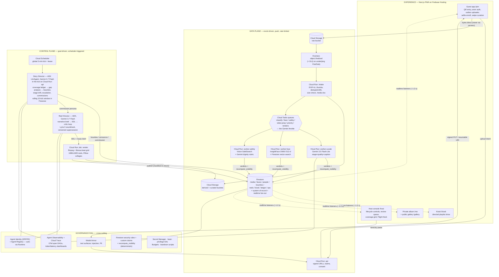
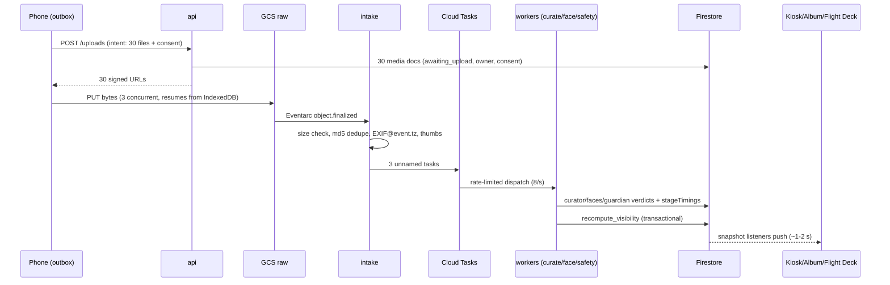

# Showrunner — System Architecture (review document)

> **Visual interactive viewer**: open [`architecture.html`](architecture.html) for the full infographic diagram, interactive zoomable Mermaid flowcharts, sequence diagrams, and theme toggles.

This is the complete architecture in one place, for review and for deriving the submission diagram. Mermaid blocks render on GitHub. Verified platform facts behind every choice: `research/google-stack-research-2026-08-24.md`. Behavior contracts: `specs/01–11`.

---

## 1. The one-paragraph shape

**An event-driven data plane feeding a goal-driven control plane, with governance as a cross-cutting rail.** Guest media flows push-based from phones into Cloud Storage, through Eventarc and rate-limited Cloud Tasks queues, into three perception workers (Gemini classification, face embedding, safety), landing as richly-annotated Firestore documents whose real-time listeners drive every screen. Above that, director agents own strategy: one watches coverage and dispatches bounties to the crowd; one commissions and renders reels. A single deterministic visibility function — not any LLM — decides what the public ever sees.

**Where the directors run, stated plainly because the answer changed during the build:** the Story Director runs on Cloud Run, inside the Cloud Scheduler tick that already holds the per-event lease, not on Agent Runtime. Its reasoning step is one ADK `LlmAgent`; everything around it — the coverage aggregation, the guardrails, the bounty writes, the points award, the rolling tick window — is deterministic Python, because by this document's own agent test (§3) those steps make no judgments and therefore must not be agents. What that costs is the managed Sessions/Memory Bank/Registry rows Agent Runtime grants automatically; what it buys is that the guardrails execute in the same process and the same transaction scope as the lease protecting them. The host's free-text preferences are the one soft input, and they are read from Memory Bank when an Agent Engine resource is configured and from the event document otherwise — nothing that gates a bounty, a point award or an exposure reads either.

---

## 2. Master diagram

---

## 3. The three flows that matter (sequence level)

### 3.1 A photo's journey (p50 ≈ 5 s to kiosk-eligible)

### 3.2 The bounty loop (fully autonomous — the Taskmaster demo)

Scheduler tick → lease → Story Director reads coverage ledger → "Pheras active, 0 photos of bride's mother" → ISSUE_BOUNTY (guardrail-validated) → Firestore → every guest PWA's listener pops the mission banner → guest shoots → upload flows the normal pipeline via the priority queue with `bountyId` stamped → curate + face verdicts checked against bounty criteria → transactional award → leaderboard + kiosk celebration. No human anywhere.

### 3.3 The reel loop (with self-improvement)

Commission (stage end / director action / host) → SELECT diversity-sampled candidates (snapshot) → narrative brief from *actual* evidence → storyboard + EDL + music brief (3.7 Flash) → critic rubric pass → Lyria 3 clip ($0.04) → librosa beat grid → cuts quantized → Cloud Run Job renders ffmpeg filtergraph → manifest re-validated → published → kiosk premiere. Better photo arrives later → evaluator triggers **v2 supersession** (debounced, frozen at final cut).

---

## 4. GCP service inventory — used, and deliberately not used

### Used (every one called in code, not just named)

| Service | Role | Why this one |
|---|---|---|
| Cloud Run (services) | api, intake, 3 perception workers, publisher, dlq-consumer | Serverless burst scaling; per-service least-privilege SAs |
| Cloud Run (jobs) | reel/collage renders | Long CPU work off the request path |
| Cloud Storage | raw / derived / curated buckets | Direct-from-phone via signed URLs; the burst shock absorber |
| Eventarc (+ Pub/Sub under it) | object.finalized → intake, with DLQ | Canonical 2026 event routing; retries + dead-lettering |
| Cloud Tasks | 6 queues | The **only** throttle in the system — server-side rate control onto Gemini spend tiers |
| Cloud Scheduler | global director tick, orphan sweep | Control-loop cadence without per-event infra |
| Firestore (+ native vector search) | system of record, realtime fan-out, face KNN | One database is both state machine and push channel; GA vector search is exactly right at 10k faces |
| Firebase Auth (anonymous + custom tokens/claims) | zero-friction guests, magic links, host claim | Identity without signup friction |
| Firebase Hosting | PWA + kiosk | CDN included |
| FCM | web push (progressive enhancement) | Firestore banners remain the demo-safe primary |
| **ADK (Agent Development Kit)** | Curator, Guardian, Story Director, bounty validator | Structured output, plugin seam (Model Armor sits in front of the model, not beside it), one runner per agent per process |
| **Agent Runtime (GEAP)** | *optional*: Memory Bank for the host's free-text standing preferences, scoped `{eventId}:host` | Not on the critical path. The Story Director runs in the Cloud Scheduler tick on Cloud Run (§1) so its guardrails execute in the same process as the lease protecting them; Memory Bank holds taste and never anything that gates exposure or spend (spec 11 §4) |
| Model Armor | host itinerary, captions, bounty text | Used *as designed* — prompt injection/PII on text surfaces (image screening is Preview; wrong tool for photos) |
| Cloud Vision | SafeSearch + face quality/joy signals | GA visual safety gate; emotion/blur ranking |
| Gemini 3.5 Flash-Lite / 3.7 Flash | perception volume / director reasoning | Price-performance split; both satisfy "3.5 or newer" |
| Lyria 3, Veo 3.1 Fast, Nano Banana 2, Gemma 4 | soundtracks, hero intro, portraits, private taste memos (spec 07 §2) | All four bonus models, each with a real, non-redundant job — Gemma is deliberately kept off the Curator's already-existing caption path and isolated to a non-critical feature |
| Cloud Trace + Agent Observability (OTel) | span DAGs, token/latency dashboards | The 30% architecture score, visible |
| Secret Manager, IAM, Budgets | key handling, per-service SAs, cost rails | "Credential security" is an explicit judging line |

### Deliberately not used (the honest table — judges reward knowing why)

| Service | Why not |
|---|---|
| GKE | Cloud Run gives identical container semantics with zero cluster ops at this scale |
| Cloud SQL / AlloyDB | No relational workload; Firestore is both DB and realtime channel |
| Vertex AI Vector Search | ~$65+/mo idle ScaNN infra for 10k vectors; flat exact KNN is *more* accurate here. Stated evolution path at ~1M faces |
| Transcoder API | Hard cuts only — no transitions/captions/Ken Burns; cannot make a reel |
| Agent Gateway | The one heavy GEAP piece (networking provisioning); Registry/Identity/Armor/Observability cover the governance story |
| Dataflow / BigQuery | No streaming-analytics workload; Firestore aggregations feed the coverage ledger. (Optional P2: Firestore→BigQuery export for the wrap-up report) |
| Memorystore | No hot cache need; Firestore listeners are the cache |

---

## 4.5 The Best Architectural Design case — scoring map

The Architecture criterion (30%) is scored on specific rubric phrases; each maps to a mechanism that already exists in specs 01–11 and is visible somewhere a judge will actually look. This table is an index, not a claim — every row is enforced by an acceptance criterion in its spec.

| Rubric phrase (verbatim) | Mechanism here | Where a judge sees it |
|---|---|---|
| "clean, modularized, ease of maintenance" | Every deployable unit has one job (spec 09 §1: api, intake, 3 perception workers, publisher, render job, 2 directors); one *parameterized* Reel Director taking commissions instead of N copy-pasted agents (spec 06 §1); one Event Type Profile object (spec 11 §2) drives Curator/Guardian/Story/Reel behavior via configuration, not per-culture code branches; agents composed as ADK graph nodes | Repo layout mirrors the service inventory; Flight Deck lanes mirror service boundaries; the onboarding template picker |
| "state management" | Per-media state machine with parallel stage flags + derived status (spec 03 §3); `event.status` as the system master switch (spec 08 §2); director Sessions bounded to a rolling 10-tick window + the Memory Bank split — Firestore is the *system of record*, Memory Bank is the *agent's memory*, and VIP tier is deterministic metadata that never enters memory at all (specs 05 §1, 07 §2/§4.1, 11 §4); a global platform capacity counter (spec 11 §1) as explicit, transactional state, not an assumption | Firestore console mutating on camera; Observability Sessions tab; the capacity-refusal message on a 4th Go Live attempt |
| "tools properly isolated and scoped for security" | Per-service least-privilege SAs (spec 09 §4: intake can't call Gemini; render is the only curated-bucket writer; neither perception worker that reads a photo has *any* grant on the raw bucket); auto SPIFFE Agent Identity; Model Armor on every text surface as an ADK plugin **plus** an ingress check at the surface that accepts the text; Content-Length-pinned signed URLs; security rules read custom claims only, and **biometrics are in their own collection precisely because a rule grants whole documents** (`enrollments/{personId}`, unreadable by every client including the host — a person document has to stay readable for kiosk credits and VIP tiers); the "feature this person" host override is a *ranking* override that is structurally unable to bypass `recompute_visibility` (spec 11 §3.5) | `rules-tests/run_matrix.py` — 63 assertions, each a named persona trying to cross a boundary; 15-s console corroboration; the Model Armor injection block in the trace; README security section |
| "how does the system recover if a worker agent loops or returns a hallucination?" | Guarded action executors: director actions validated against hard guardrails (≤2 bounties/tick, point bounds, confidence gates — fuzz-tested, spec 05 §5); critic loop capped at ≤1 retry + deterministic EDL linter (spec 06 §2); Guardian refusal/schema failure defaults to `host_review`, never `public_ok` (spec 03 §5.3); LLMs never write `visibility` — `recompute_visibility` is the single writer (spec 04 §2) | Action fuzz test in the repo; Flight Deck DLQ tray + red-pulse retry; trace DAG |
| "robust, failure-tolerant… decouple systems" | Eventarc at-least-once + DLQ; idempotent handlers keyed on status transactions (never named tasks); transient-vs-poisoned failure taxonomy (spec 03 §6); queue rates calibrated to spend-tier math with the burst SLA stated honestly (spec 09 §2); split-brain cluster reconciliation (spec 03 §5.2); per-event publisher leader election instead of a global singleton (spec 04 §4) — the same lease pattern spec 05 already uses, reused rather than reinvented | Chaos test visible on the Flight Deck: kill worker-curate mid-burst, watch the queue absorb and drain |

Named patterns to say out loud (video + README): **event-driven data plane, goal-driven control plane** · **judgment by agents, enforcement by policy** · **the anti-agent-washing census** (5 fleet members, honestly typed — HANDOFF §5) · **the deliberately-not-used table** (§4 above) · **anticipate the predictable, reconcile the statistical** (spec 05 §2) · **per-event leader election, not global serialization** (spec 04 §4) · **the host declares cultural context, the system never assumes it** (spec 11 §2) · **VIP is policy, not memory** (spec 11 §4).

---

## 5. How the demo *shows* the pipeline (not console-tab roulette)

The centerpiece is the **Flight Deck** (`/host/flightdeck`, spec 10): a live page that renders **this architecture diagram with real traffic flowing through it** — each uploaded photo animates as a thumbnail chip moving Phone → Cloud Storage → Eventarc → intake → the three worker lanes → Firestore → kiosk, with per-stage live latencies, queue depths, Gemini token/cost tickers, and a director activity feed. It is driven entirely by the same Firestore `stages`/`stageTimings` fields the pipeline already writes, so it is truthful, reliable on camera, and free of console-login friction. GCP console shots (Cloud Run list, Observability trace DAG, Firestore mutating) then serve as 15-second *corroboration*, which the rules require — not as the narrative.

---

## 6. Review checklist (what to sanity-check when you read this)

- [ ] Every arrow in §2 is push except Scheduler→SD (deliberate control loop) — agreed?
- [ ] The only writer of `visibility` is `recompute_visibility`; LLMs never gate exposure — agreed?
- [ ] Cloud Tasks as the single throttle point (not Pub/Sub fan-out) — agreed?
- [x] Directors on Agent Runtime vs everything-on-Cloud-Run — **settled 2026-08-28: Cloud Run, inside the tick.** The guardrails are the product; they belong in the same process and transaction scope as the lease that serialises them. Agent Runtime stays optional, for Memory Bank only.
- [ ] Face identity in our ONNX model + Firestore, never Gemini — agreed?
- [ ] Kill switches: event.status master switch + publicFrozen panic + per-item yank — sufficient?
- [ ] Cluster fragmentation is harmless (face-level claims) and self-healing (hourly merge sweep, spec 03 §5.2) — agreed?
- [ ] Ops telemetry is per-worker-type shards, never a shared hot doc (spec 10 §2) — agreed?
- [ ] The Guardian's two passes are split by *kind of question*: SafeSearch answers a category question deterministically and unappealably (and short-circuits the model call entirely on `adult ≥ LIKELY`), while the dignity rubric answers a contextual one and can only ever make a verdict *more* conservative — the host's declared sensitivity dial is a ceiling, `minor_prominent` is a deterministic rule, and a refusal defaults to `host_review` (spec 03 §5.3, spec 11 §2) — agreed?
- [ ] No client reads a face embedding or a selfie template — the biometric lives in a collection with no `allow` rule at all, rather than as a field on a document clients must read (spec 02 §4) — agreed?
- [ ] Every app query's filters *prove* its read rule: Firestore fails a whole query when one returned document is denied, so query shape and rules are one design, tested together — agreed?
- [ ] Queue rates trace to spend-tier math and the burst SLA is stated honestly (spec 09 §2) — agreed?
- [ ] The publisher is a per-event lease holder, not a global `max-instances=1` singleton — two concurrent live events never contend for one process (spec 04 §4, spec 09 §1) — agreed?
- [ ] A platform-level concurrent-live-event cap exists and is enforced server-side, not just as a UI hint (spec 11 §1) — agreed?
- [ ] Cultural/sensitivity context is 100% host-declared configuration (spec 11 §2) — grep for any hardcoded per-religion/per-ethnicity branch in a prompt template; there should be none — agreed?
- [ ] VIP tier is read-only deterministic metadata everywhere it's consumed (kiosk score, reel SELECT, bounty ledger/points) and never written to or inferred from Memory Bank (spec 11 §3.3, §4) — agreed?
- [ ] `class` (`protected_demo`/`internal_dev`/`public`) is server-assigned only, never client-settable, and a judge's tour never touches the public capacity cap/TTL/cost-ceiling at all — those exist purely for the platform's own cost/hygiene exposure to strangers (spec 11 §1.1) — agreed?
- [ ] No surface personalizes a *shared* feed per-viewer (kiosk, `/gallery`) — "featuring" someone is either a shared re-ranking (`vipWeight`) or lives in their own private album; per-visitor versions of a shared feed were considered and deliberately rejected (spec 11 §3.4, spec 04 §3) — agreed?
