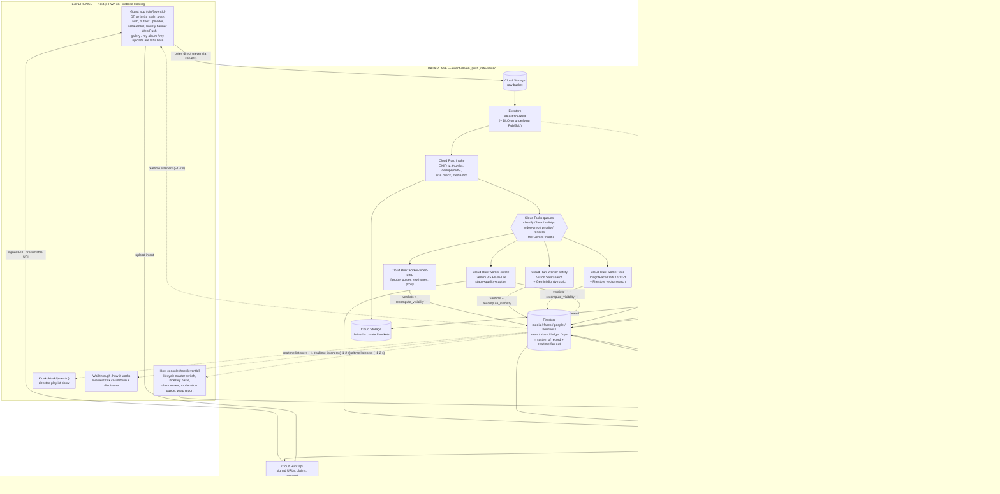
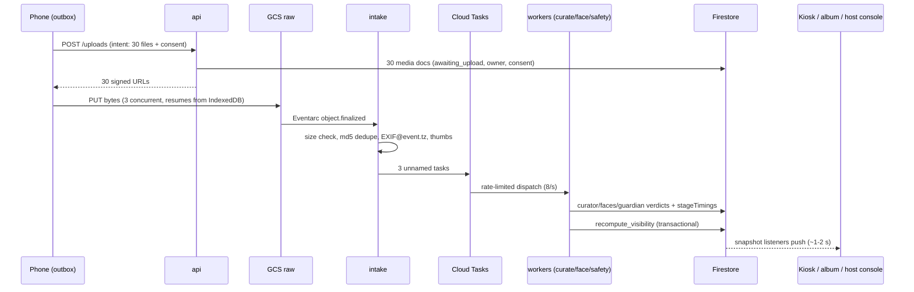

# Showrunner — System Architecture (review document)

> **Start here — one page, one glance**: [`assets/architecture-simple.pdf`](assets/architecture-simple.pdf)
> ([PNG](assets/architecture-simple.png)). The high-level workflow only: six labelled stages, one sentence per
> box, every agent named with its framework, its model and where it runs. Nothing on it that is not on the
> main path. This is the file to hand anyone who wants to understand the system by looking at it.
>
> **The deep version**: [`assets/architecture.pdf`](assets/architecture.pdf) — 7 pages, page 1 the
> one-glance overview (also [`architecture-overview.png`](assets/architecture-overview.png)), pages 2–7 the
> low-level design: deployment topology & identity · the data plane · the control loop, state & memory ·
> the reel pipeline · trust & governance · failure, scale & cost. Rebuild it with
> `python scripts/render_architecture.py`; the sources are
> [`assets/architecture-overview.html`](assets/architecture-overview.html) and
> [`assets/architecture-lld.html`](assets/architecture-lld.html) over `assets/arch.css`.
>
> **Visual interactive viewer**: open [`architecture.html`](architecture.html) for the full infographic diagram, interactive zoomable Mermaid flowcharts, sequence diagrams, and theme toggles.

This is the complete architecture in one place, for review and for deriving the submission diagram. Mermaid blocks render on GitHub. Verified platform facts behind every choice: `research/google-stack-research-2026-08-24.md`. Behavior contracts: `specs/01–13` (13 is the generic timeline-first pivot — itinerary-led creation and multi-day runtime — and it revises 03/04/05/06/08/11).

---

## 1. The one-paragraph shape

**An event-driven data plane feeding a goal-driven control plane, with governance as a cross-cutting rail.** Guest media flows push-based from phones into Cloud Storage, through Eventarc and rate-limited Cloud Tasks queues, into three perception workers (Gemini classification, face embedding, safety) plus a video-prep worker, landing as richly-annotated Firestore documents whose real-time listeners drive every screen. Above that, director agents own strategy: one watches coverage and dispatches bounties to the crowd; one commissions and renders reels. A single deterministic visibility function — not any LLM — decides what the public ever sees.

**Where the directors run, stated plainly because the answer changed during the build:** the Story Director runs on Cloud Run, inside the Cloud Scheduler tick that already holds the per-event lease, not on Agent Runtime. Its reasoning step is one ADK `LlmAgent`; everything around it — the coverage aggregation, the guardrails, the bounty writes, the points award, the rolling tick window — is deterministic Python, because by this document's own agent test (§3) those steps make no judgments and therefore must not be agents. What that costs is the managed Sessions/Memory Bank/Registry rows Agent Runtime grants automatically; what it buys is that the guardrails execute in the same process and the same transaction scope as the lease protecting them. The host's free-text preferences are the one soft input, and they are read from Memory Bank when an Agent Engine resource is configured and from the event document otherwise — nothing that gates a bounty, a point award or an exposure reads either.

---

## 2. Master diagram

---

## 3. The three flows that matter (sequence level)

### 3.1 A photo's journey (p50 ≈ 5 s to kiosk-eligible)

### 3.2 The bounty loop (fully autonomous — the Taskmaster demo)

Scheduler tick → lease → Story Director reads coverage ledger → "Pheras active, 0 photos of bride's mother" → ISSUE_BOUNTY (guardrail-validated) → Firestore → every guest PWA's listener pops the mission banner → guest shoots → upload flows the normal pipeline via the priority queue with `bountyId` stamped → curate + face verdicts checked against bounty criteria → transactional award → leaderboard + kiosk celebration. No human anywhere.

### 3.3 The reel loop (with self-improvement)

Commission (stage end / director action / host) → SELECT diversity-sampled candidates (snapshot) → narrative brief from *actual* evidence → storyboard + EDL + music brief (3.7 Flash) → critic rubric pass → Lyria 3 clip ($0.04) → librosa beat grid → cuts quantized → Cloud Run Job renders ffmpeg filtergraph → manifest re-validated → published → kiosk premiere. Better photo arrives later → evaluator triggers **v2 supersession** (debounced, frozen at final cut).

---

## 4. GCP service inventory — used, and deliberately not used

### Used (every one called in code, not just named)

| Service | Role | Why this one |
|---|---|---|
| Cloud Run (services) | **8** — api, intake, dlq, worker-curate, worker-face, worker-safety, worker-video-prep, publisher | Serverless burst scaling; one least-privilege SA per service (12 identities in total, incl. the job and the three OIDC callers) |
| Cloud Run (jobs) | **1** — `render`, one execution per reel commission | Long CPU work off the request path; started through the Run Admin API, because Cloud Tasks cannot start a Job |
| Cloud Storage | raw / derived / curated buckets | Direct-from-phone via signed URLs; the burst shock absorber |
| Eventarc (+ Pub/Sub under it) | object.finalized → intake, with DLQ | Canonical 2026 event routing; retries + dead-lettering |
| Cloud Tasks | 6 queues | The **only** throttle in the system — server-side rate control onto Gemini spend tiers |
| Cloud Scheduler | global director tick, orphan sweep | Control-loop cadence without per-event infra |
| Firestore (+ native vector search) | system of record, realtime fan-out, face KNN | One database is both state machine and push channel; GA vector search is exactly right at 10k faces |
| Firebase Auth (anonymous + custom tokens/claims) | zero-friction guests, magic links, and the three claims every rule reads: `personId`, `hosts[]`, `members[]` | Identity without signup friction — and the only way to answer "who is this" inside a security rule without a billed `get()`. `hosts`/`members` are arrays because one host runs several events and one phone attends several; creating an event needs no account at all, and Google is an optional post-hoc `linkWithPopup` on the same uid |
| Firebase Hosting | PWA + kiosk | CDN included |
| FCM | Web Push for bounty delivery — **now load-bearing, not progressive enhancement** | A bounty that only reaches a foreground tab reaches almost nobody, so the crowd-directing half of the product depended on this. Audience resolved deterministically from the bounty's `audience` field; the registration token lives in a deny-all `guests/{uid}/private/push` (a token is an address, and the leaderboard streams that collection); sending never raises, so an FCM outage costs a notification and never a tick or an award. The service worker imports no SDK — FCM on the web is W3C Web Push underneath (`backend/shared/push.py`) |
| **ADK (Agent Development Kit)** | Curator, Guardian, Story Director, bounty validator | Structured output, plugin seam (Model Armor sits in front of the model, not beside it), one runner per agent per process |
| **Agent Runtime (GEAP)** | *optional*: Memory Bank for the host's free-text standing preferences, scoped `{eventId}:host` | Not on the critical path. The Story Director runs in the Cloud Scheduler tick on Cloud Run (§1) so its guardrails execute in the same process as the lease protecting them; Memory Bank holds taste and never anything that gates exposure or spend (spec 11 §4) |
| Model Armor | host itinerary, captions, bounty text | Used *as designed* — prompt injection/PII on text surfaces (image screening is Preview; wrong tool for photos) |
| Cloud Vision | SafeSearch + face quality/joy signals | GA visual safety gate; emotion/blur ranking |
| Gemini 3.5 Flash-Lite / 3.7 Flash | perception volume / director reasoning | Price-performance split; both satisfy "3.5 or newer" |
| Lyria 3, Veo 3.1 Fast, Gemma 4 | reel soundtracks, the cached 8 s opener, the world-model prose and the private taste memo (spec 07 §2) | Three bonus models, each with a real, non-redundant job on a product path — Gemma is deliberately kept off the Curator's already-existing caption path and isolated to a feature that gates nothing |
| Nano Banana 2 (`gemini-3.1-flash-image`) | **fixture generation only** — the eval cast's fictional portraits (`eval/cast.py`) | Stated separately rather than listed above, because it is genuinely called in code but on no product path. Its job is that the golden-fixture cast contains no real person's likeness |
| Cloud Logging (structured) | one JSON line per stage per item (`event_id`, `media_id`, `stage`, `ms`, verdict); a saved event-filtered query is the live evidence surface | **There is no OpenTelemetry instrumentation and no Agent Observability dashboard in this build** — there is no Agent Runtime deployment to attach one to. What exists instead is queryable: `platform/tickPulse` (proves the fleet acted unprompted), `ledger/directorState` (what the director decided, deferred and could not get), `stageTimings` per item, and severity-tagged `ops/` alerts sharded per worker type |
| Secret Manager, IAM, Budgets | key handling, per-service SAs, cost rails | "Credential security" is an explicit judging line |

### Deliberately not used (the honest table — judges reward knowing why)

| Service | Why not |
|---|---|
| GKE | Cloud Run gives identical container semantics with zero cluster ops at this scale |
| Cloud SQL / AlloyDB | No relational workload; Firestore is both DB and realtime channel |
| Vertex AI Vector Search | ~$65+/mo idle ScaNN infra for 10k vectors; flat exact KNN is *more* accurate here. Stated evolution path at ~1M faces |
| Transcoder API | Hard cuts only — no transitions/captions/Ken Burns; cannot make a reel |
| Agent Gateway | The one heavy GEAP piece (networking provisioning); Registry/Identity/Armor/Observability cover the governance story |
| Dataflow / BigQuery | No streaming-analytics workload; Firestore aggregations feed the coverage ledger. (Optional P2: Firestore→BigQuery export for the wrap-up report) |
| Memorystore | No hot cache need; Firestore listeners are the cache |

---

## 4.5 Design rationale

The Architecture criterion (30%) weighs a specific set of properties: modularity, state management, security isolation, and failure recovery. This table maps each to the mechanism that implements it in specs 01–11 — an index, not a claim; every row is enforced by an acceptance criterion in its spec.

| Property | Mechanism here |
|---|---|
| Modularity and maintainability | Every deployable unit has one job (spec 09 §1: api, intake, 3 perception workers, publisher, render job, 2 directors); one *parameterized* Reel Director taking commissions instead of N copy-pasted agents (spec 06 §1); one Event Type Profile object (spec 11 §2) drives Curator/Guardian/Story/Reel behavior via configuration, not per-culture code branches; agents composed as ADK graph nodes |
| State management | Per-media state machine with parallel stage flags + derived status (spec 03 §3); `event.status` as the system master switch (spec 08 §2); director Sessions bounded to a rolling 10-tick window + the Memory Bank split — Firestore is the *system of record*, Memory Bank is the *agent's memory*, and VIP tier is deterministic metadata that never enters memory at all (specs 05 §1, 07 §2/§4.1, 11 §4); a global platform capacity counter (spec 11 §1) as explicit, transactional state, not an assumption |
| Tools isolated and scoped for security | Per-service least-privilege SAs (spec 09 §4: intake can't call Gemini; render is the only curated-bucket writer; neither perception worker that reads a photo has *any* grant on the raw bucket); Model Armor on every text surface as an ADK plugin **plus** an ingress check at the surface that accepts the text; Content-Length-pinned signed URLs; security rules read custom claims only, and **the read boundary is the event, not the session**: `isMember(eventId)` resolves against a `members` array claim minted by `POST /join`, so an eventId — which lives in a QR code and an address bar — is worth nothing on its own (spec 04 §2); **anything private is a separate document, precisely because a rule grants whole documents** — biometrics in `enrollments/{personId}` and `faces/`, and `uidLinks` plus the Gemma-written taste memo in `people/{personId}/private/profile`, all denied to every client including the host, because the person document itself has to stay readable for kiosk credits and VIP tiers; the "feature this person" host override is a *ranking* override that is structurally unable to bypass `recompute_visibility` (spec 11 §3.5) |
| Recovery from a looping or hallucinating worker | Guarded action executors: director actions validated against hard guardrails (≤2 bounties/tick, point bounds, confidence gates — fuzz-tested, spec 05 §5); critic loop capped at ≤1 retry + deterministic EDL linter (spec 06 §2); Guardian refusal/schema failure defaults to `host_review`, never `public_ok` (spec 03 §5.3); LLMs never write `visibility` — `recompute_visibility` is the single writer (spec 04 §2) |
| Robust, failure-tolerant, decoupled systems | Eventarc at-least-once + DLQ; idempotent handlers keyed on status transactions (never named tasks); transient-vs-poisoned failure taxonomy (spec 03 §6); queue rates calibrated to spend-tier math with the burst SLA stated honestly (spec 09 §2); split-brain cluster reconciliation (spec 03 §5.2); per-event publisher leader election instead of a global singleton (spec 04 §4) — the same lease pattern spec 05 already uses, reused rather than reinvented |

Named patterns worth carrying into the README and video: **event-driven data plane, goal-driven control plane** · **judgment by agents, enforcement by policy** · **the anti-agent-washing census** (5 fleet members, honestly typed — HANDOFF §5) · **the deliberately-not-used table** (§4 above) · **anticipate the predictable, reconcile the statistical** (spec 05 §2) · **per-event leader election, not global serialization** (spec 04 §4) · **the host declares cultural context, the system never assumes it** (spec 11 §2) · **VIP is policy, not memory** (spec 11 §4).

---

## 5. How the demo *shows* the pipeline

Spec 10's Flight Deck — a live page rendering this architecture diagram with real traffic animating through it — is **cut** (S12): the video plan had already demoted it to a few seconds of narrative, so building it earned less than the sessions it would have cost. What corroborates the pipeline on camera instead is direct evidence from the platform itself: the Cloud Run services list (eight services plus the render job, one revision tag, all healthy), the Cloud Scheduler job detail page (`director-tick` / `director-tick-demo`, `Last run: Success`), Firestore console documents mutating in real time as a photo clears each stage, and a saved, event-filtered Logs Explorer query streaming the one-line-per-stage logs (`stage=curate media=… ms=… verdict=…`) every worker writes. The `/how-it-works` page's live next-tick countdown (spec 09 §4) is the same evidence surfaced without a console login. None of this is staged UI — it is the same Firestore fields and GCP consoles a judge could open themselves.

---

## 6. Known limits and open questions

**Timeline-first, not template-first (spec 13) — the shape the product settled into.** Creation takes a name, a timezone, a date range and an expected head-count, then a **pasted itinerary** (text, PDF or a photographed schedule) which `gemini-3.5-flash-lite` turns into date-anchored *proposals*. `PUT /stages` stays the only writer of a real UTC window, so a parse is never silently authoritative; the spec-11 Event Type Profiles survive as data behind a Settings `<select>`, never as an entry surface, which strengthens rather than weakens §2's rule that the system never infers cultural context — now it does not even ask first. Multi-day runtime follows from one resolver (`shared/stages.py::resolve_active`) adopted by the ledger, the publisher, the public endpoint and both perception workers, plus day-indexed prompts, a per-day group-coverage gap driven by an increment-only people-count histogram, and idle ticks that skip the REASON call entirely (zero tokens overnight, which is ~90% of a five-day event's ticks).

**`activeStage` is a pin with an expiry, and that is a correctness fix rather than a nicety (2026-08-31).** The precedence has always been `stageOverride || activeStage || schedule`, and `activeStage` had exactly one writer (an accepted auto-advance) and *nothing that cleared it*. Because it sits above the schedule, the first auto-advance of an event disabled the schedule leg permanently: every later transition then depended on the model proposing another advance and the guardrails accepting it, and one missed advance stranded the pointer for the rest of the event — invisibly, because a stale pin is indistinguishable from a deliberate one. A pin is now honoured only until its own stage's window has ended plus `STAGE_GAP_GRACE_MINUTES`, reusing the exact cutoff the ledger already uses to stop a lapsed stage bidding for bounty budget. Read-side only (no write, no migration, no second writer); a stage with no `endsAt` never lapses so undated events are byte-for-byte unchanged; and `stageOverride` is never subject to expiry, so a host holding the stage manually still holds it indefinitely. Its sibling: an auto-advance may no longer *target* a lapsed stage at all — the drift signal samples by `uploadedAt`, so a batch of Day-1 photos dumped on Day 3 could otherwise have walked the event backwards.

**Coverage of a person is measured two ways, because one of them could never see the photographer (2026-08-31).** The original person gap was binary — zero appearances in the active stage — which one frame at breakfast satisfied permanently. The person who spends the whole trip holding the camera therefore never registered as under-covered, which is the single most common instance of the problem this product exists to solve. A second, *relative* leg compares each named person's event-wide appearance count against the **median** across the group (a mean lets the one person everybody photographs drag the bar until the entire rest of the group reads as neglected) and fires below `ceil(median × 0.6)`. Deliberately silent on small or young events: under three named people there is no distribution to be beneath, and under a median of four the number carries no information. Absent still outranks thin, and it is one gap per person, so nobody occupies two of the eight prompt slots.

**Settled design positions, stated once here rather than re-litigated per session:** every arrow in §2 is push except Scheduler→SD, a deliberate control loop. The only writer of `visibility` is `recompute_visibility`; no LLM ever gates exposure. Cloud Tasks is the single throttle point (not Pub/Sub fan-out). Face identity runs on our own ONNX model plus Firestore vector search — Gemini is never used for identity. Cluster fragmentation is harmless (claims operate at the face level) and self-healing (an hourly merge sweep, spec 03 §5.2). **No face match grants an album on its own** — every enrollment and every re-claim is written as a held claim the host approves in the console, host-declared people are approved by construction, and the face indexer's auto-linker is gated on that approval, so a pending request accretes nothing while it waits (spec 02 §3, hardened after a live defect; the alternative — trusting a match whenever the album looked unimportant — is only as strong as the guess about which albums are worth stealing). A denial reverses rather than records, deleting the person document and the selfie template when the refused claim is what created them, because a stored template left behind is an unapproved biometric waiting in the match index. **The read boundary is the event, not the sign-in** — `isMember(eventId)` reads a `members` array claim minted by `POST /v1/events/{eventId}/join`, replacing a predicate that was literally `signedIn()` and therefore let anyone holding any eventId read that event's wall, guest list, names and tiers (spec 04 §2); membership rides in a claim rather than a document because a rule may not `get()`. **`access.mode` (`open` | `invite`, plus a seat cap counted in uids, not humans) is an axis orthogonal to the consent rings and to `class`:** rings decide what a member may see, `access.mode` decides how many people the event has, `class` decides what platform guardrails the *deployment* applies to it — `recompute_visibility` keeps exactly its old inputs, no media document gained an audience field, and no code path reads one axis to decide another (spec 08 §3, spec 11 §1.1). Two residual exposures are documented rather than closed and should be read as stated limits: a member reads whole media documents (`albumOf`, `subjectVetoes`, `usage`), and the kiosk playlist stays world-readable because narrowing it would need a `get()` — the collections it points into are all member-gated and the byte paths refuse non-members on an invite-only event. Ops telemetry is sharded per worker type, never a shared hot document (spec 10 §2). The Guardian's two passes are split by *kind of question*: SafeSearch answers a category question deterministically and unappealably — it short-circuits the model call entirely on `adult ≥ LIKELY` — while the dignity rubric answers a contextual one and can only ever make a verdict *more* conservative; the host's declared sensitivity dial is a ceiling, `minor_prominent` is a deterministic rule, and a refusal defaults to `host_review` (spec 03 §5.3, spec 11 §2). No client reads a face embedding or a selfie template — the biometric lives in a collection with no `allow` rule at all, rather than as a field on a document clients must read (spec 02 §4). Every app query's filters *prove* its read rule, because Firestore fails a whole query when one returned document is denied, so query shape and rules are one design, tested together. Queue rates trace to spend-tier math and the burst SLA is stated honestly (spec 09 §2). The publisher is a per-event lease holder, not a global `max-instances=1` singleton, so two concurrent live events never contend for one process (spec 04 §4, spec 09 §1). A platform-level concurrent-live-event cap exists and is enforced server-side, not just as a UI hint (spec 11 §1). Cultural/sensitivity context is 100% host-declared configuration (spec 11 §2) — no prompt template carries a hardcoded per-religion or per-ethnicity branch. VIP tier is read-only deterministic metadata everywhere it's consumed (kiosk score, reel SELECT, bounty ledger/points) and is never written to or inferred from Memory Bank (spec 11 §3.3, §4). `class` (`protected_demo`/`internal_dev`/`public`) is server-assigned only, never client-settable, and a judge's tour never touches the public capacity cap, TTL, or cost ceiling at all — those exist purely for the platform's own cost/hygiene exposure to strangers (spec 11 §1.1). No surface personalizes a *shared* feed per-viewer (kiosk, the public gallery) — "featuring" someone is either a shared re-ranking (`vipWeight`) or lives in their own private album; per-visitor versions of a shared feed were considered and deliberately rejected (spec 11 §3.4, spec 04 §3).

**Front-door routing — settled, and an inversion of what spec 12 §5.1 first specified.** `/` is a landing page with three choices (**Create an event** → `/host`, **Join an event** → `/join`, **See how it works** → `/how-it-works`); it used to be a client redirect into the walkthrough, which made a page written for evaluators the homepage for every host and guest who arrived cold. `/join` with no eventId is the invite-code and QR-scan door, because a texted code carries no event id. **No surface, route, component or query parameter is labelled "judge mode" or "demo mode"** — the label manufactures the suspicion that a special path exists for being looked at, which is the opposite of what the honesty story needs; the ranking overlay's switch is `?explain=1` (it reveals numbers the publisher already stored and changes no query, no visibility, no ordering), and the demo event's configuration is still disclosed on screen, non-optionally, under "About this demo environment" (spec 12 §1, §5.1).

**The named-template picker is gone; the tour is now a standing global demo, not a wedding (2026-08-31).** `EventTemplateId` and its preset table (`EVENT_TEMPLATE_DEFAULTS`) are deleted outright — the paragraph above describing them as "data behind a Settings `<select>`" is now stale. What survives, because it is load-bearing rather than decorative, is `EventTypeProfile` itself (`vipTopology`, `sensitivityProfile`, `culturalGlossary`, `requiredMomentsTemplate`): Guardian reads the dials for its severity ceiling, the Curator reads the glossary to keep `culturalElements` from hallucinating a tradition. Every event now starts from one neutral profile and the host edits it directly — no named-culture menu anywhere in code, prompts, or CSS (`[data-theme="wedding_*"]` and siblings are gone; `:root`'s defaults already matched the neutral `custom` theme byte-for-byte). The one `protected_demo` event (`global_demo`) is no longer a seeded wedding cast: `scripts/seed_global_event.py` writes only the Event document — no fixture photos, no AI cast — and lays out a multi-week, generic timeline (`Week 1 — First Signals`, …) instead of ceremony stages. Because a standing event with no natural end can't be bounded by the public 60-minute TTL (it's `protected_demo`-exempt from that by design), two new orthogonal fields bound its cost instead: `Event.dailyMediaCap`/`lifetimeMediaCap` (enforced transactionally in `api/uploads.py::_register_batch`, same transaction as the per-guest rate limit) and `Event.reelCommissionEveryNMedia` (enforced in `directors/reel/commission.py::commission`, alongside the existing daily reel ceiling) — both ordinary host-settable config, same "a demo convenience is honest only if a real host could set it too" discipline spec 09 §5 already established for `publicFloor`. `backend/seed.py`'s Hindu-wedding cast is untouched and still backs `eval/run_eval.py`'s golden-fixture grading and local `dev_demo` testing — it was never guest- or visitor-facing, so deleting it was never actually in scope; only the public-facing seeding path changed.

**Directors on Agent Runtime vs. Cloud Run — settled 2026-08-28, not revisited since.** The Story Director runs on Cloud Run, inside the Scheduler tick, not on Agent Runtime. The guardrails are the product; they belong in the same process and transaction scope as the lease that serialises them. Agent Runtime stays in the stack only as an optional Memory Bank for the host's free-text preferences — there is no Agent Identity, Agent Registry, or Agent Observability anywhere in this build, because none of it is wired to anything.

**Genuine limits, stated plainly:**
- The Flight Deck (spec 10) is cut entirely — no code, no claim. §5 above names what corroborates the pipeline on camera instead.
- **Reel v2 supersession and collages (spec 06 §4) are specced but not built** — one version per commission, and `ReelStatus.SUPERSEDED` exists in the schema with nothing that writes it. All five personas *are* built: `couple`, `stage_recap`, `guest_energy`, `main_character` and `event_recap` each diverge in `directors/reel/select.py` and are commissionable through the guardrailed path, with the target carried as data on the reel document rather than in the enum. The director commissions `event_recap` deterministically at `wrapping`; `main_character` is on-demand only and is never fanned out per guest.
- The public-event abuse-hardening in spec 11 §1.1 — the 60-minute auto-wrap TTL and the $3 cost ceiling — is configured as a constant (`PUBLIC_EVENT_COST_CEILING_USD`) but has no enforcing code path yet; only the concurrent-event cap and kill switch are live.
- InsightFace's `buffalo_l` weights are licensed for non-commercial research, which is fine for this hackathon; the documented production swap is AuraFace or OpenCV SFace (permissive licenses).
- `deploy/judge-mode.sh` (the judging-month posture: `*/15` director cadence, warm workers, paused nightly reseed cron) is written and reviewed but has not yet been run against the live project — it is deliberately deferred to SHIP day so it doesn't slow the demo cadence while filming is still in progress.
